<div align="center">

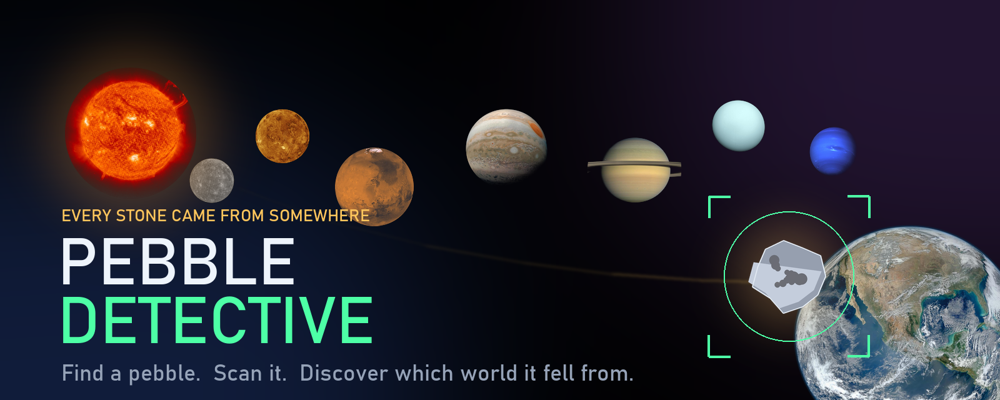

**A detective game for children, about the stones under their feet.**

Point the camera at a pebble. Tap it. The app scans it, decides which world it
fell from, and flies it home across the solar system.

[](#building-it-yourself)
[](#how-it-is-built)
[](#how-it-is-built)
[](#it-never-touches-the-network)
[](#three-languages-at-any-moment)

</div>

---

## The game

A child finds a stone. It is grey, or orange, or speckled, and it looks like it
has been somewhere. **Pebble Detective takes that question seriously.** It
examines the stone, announces which planet it came from, and then shows the
journey it must have made to land at their feet.

The science is make-believe. The curiosity is not — every answer comes with a
real photograph from NASA and a fact about that world.

---

## How it plays

### 1 · Find a pebble

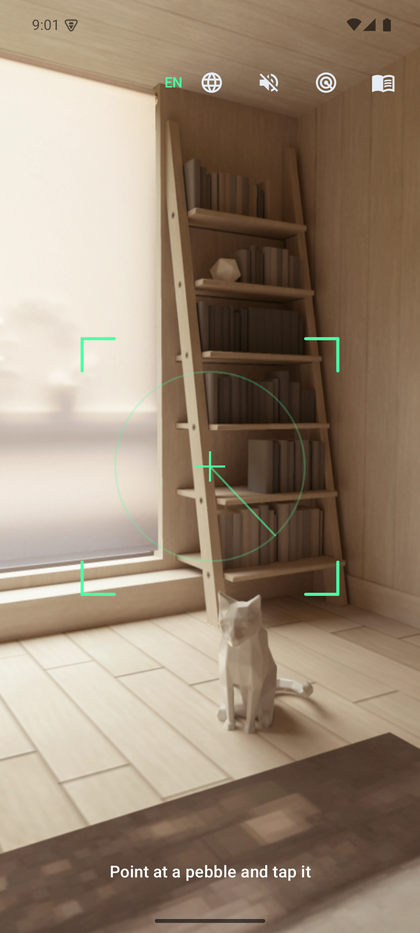

The rear camera opens with a targeting reticle sweeping the view. Tap the stone
and the reticle locks onto it.

The shot is taken when the view **settles** — the reticle fills a ring while the
child holds still, so they can see what the app is waiting for. If their hands
will not stop moving, the threshold relaxes and after a few seconds it takes the
picture anyway. A gate a child cannot satisfy is worse than no gate at all.

With sound on, the scanner idles while you hunt — a low bed with servo ticks
and sample chirps at irregular intervals, so it reads as a machine thinking
rather than a metronome. It hands over to the capture cues the moment you tap.

The moment the shutter fires, the frame freezes. That still is the pebble's
portrait, and it is the exact image the app analyses.

<br clear="right" />

### 2 · Run a Deep Research

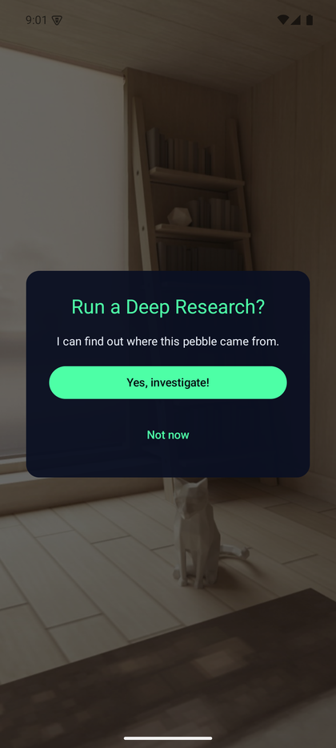

A prompt appears over the frozen photograph. Saying yes starts the investigation.

Saying *Not now* throws the stone back and returns to the camera.

<br clear="right" />

### 3 · Watch the scan

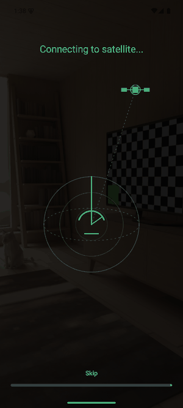

Five seconds of theatre: a dish sweeps for a satellite signal, the link locks,
and the screen falls into a cascade of glyphs while the analysis lines stream in
and a progress bar fills along the bottom.

Underneath the show, real work happens. The app reads the colour of the pebble
where the child tapped, picks a world, notes the place and time, and writes the
whole thing to the logbook.

It can be skipped at any point.

<br clear="right" />

### 4 · Meet the world

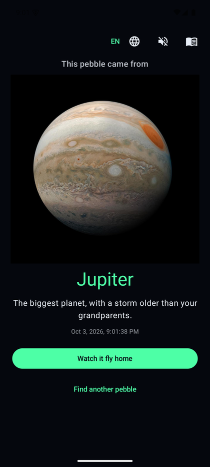

The verdict, with a real NASA photograph of the body, its name, and one fact
sized for a child.

Reddish stones come from Mars. Pale gold ones from Saturn. Deep blue from
Neptune. A plain grey pebble could be from anywhere, so the app picks at
random — and then remembers that choice forever, because a stone that changed
planet every time you looked at it would be no fun at all.

<br clear="right" />

### 5 · Fly it home

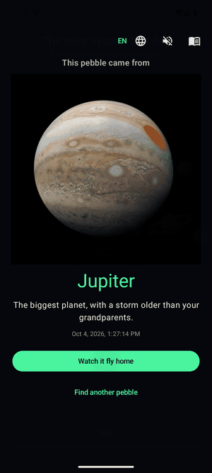

Twenty seconds of schematic space flight. The pebble launches, tumbles along a
curving arc through a warping starfield, its home world shrinking behind it and
Earth swelling ahead, until the air starts to glow orange around it.

Then it keeps going. The fireball gives way to a map of Japan, the view falls
and closes in through Kanto and over Tokyo Bay, and the pebble finally comes
down between the Sumida and the Arakawa, in Koto.

Also skippable — by the third pebble, nobody wants to sit through the whole
film again.

<br clear="right" />

<p>
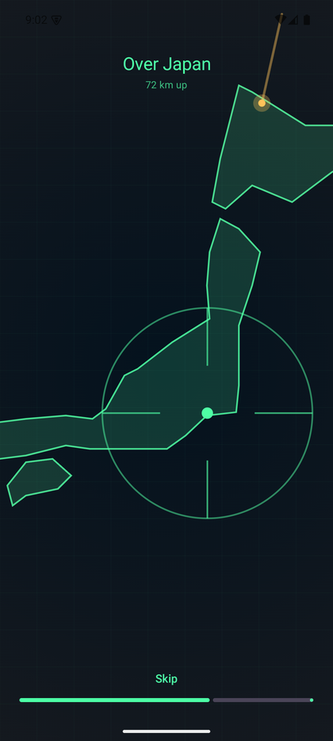
&nbsp;
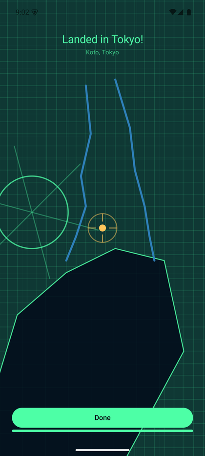
</p>

### 6 · Keep the collection

<p>
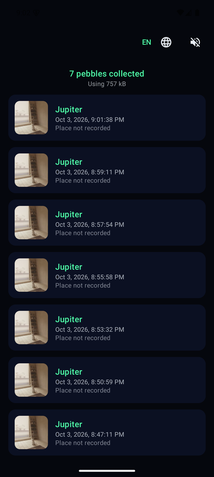
&nbsp;
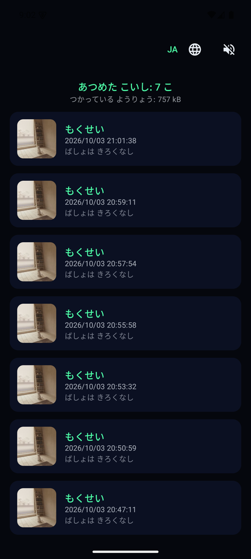
&nbsp;
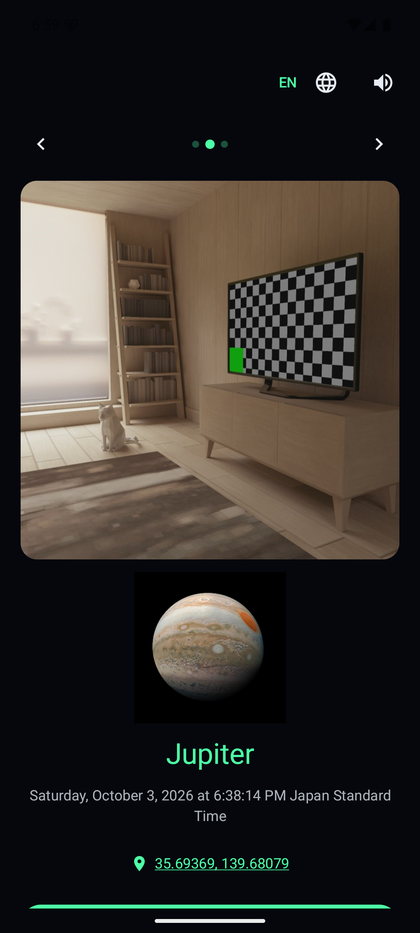
</p>

Every stone is kept: its photograph, the world it came from, when it was found
and — if location was allowed — where. Each can be deleted, and the logbook
shows how much space the collection is using.

Open one and **swipe left or right to walk through the whole collection**
without going back to the list. Arrows and a position counter sit above the
page so the gesture is discoverable and still works for anyone who cannot
swipe, and a **thumbnail strip along the bottom jumps straight to any
pebble** — thirty swipes to reach the far end of a collection is no way to
browse one.

**The coordinates are tappable** and open the spot in a map. This is the one
place the app reaches outside itself: it still holds no network permission and
makes no requests of its own, it simply hands the coordinates to whatever maps
app is installed, and that app does the talking. Worth knowing, because those
coordinates are where a child was standing.

---

## Radar mode

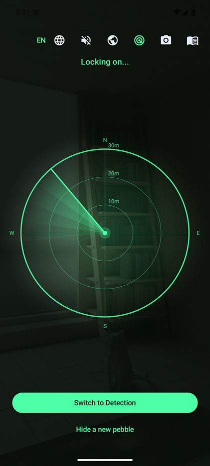

Tap the radar button in the top bar and the app **hides a virtual pebble
somewhere within thirty metres** and sends the child out to find it.

The scope is drawn over the live rear camera: range rings, a rotating sweep,
a pulsing blip and an arrow pointing the way. Your own position is the centre
and moves as you walk, and the whole display turns with the phone — the arrow
keeps pointing at the same patch of ground however you hold it, because the
target is a real coordinate rather than a spot on the screen.

Tapping radar again hides a new pebble from scratch. You can switch back to
Detection at any point, whether or not you reached it.

With sound on it plays like a detector: a room tone under the scope, a ping
each time the sweep comes round, and a proximity beep that **quickens as you
close in** — lazy at thirty metres, an urgent chatter at arm's length. The
ping and the drawn sweep share one clock, so the beep lands with the beam
crossing the top rather than drifting against it.

**Radar asks for precise location**, and it is the only part of the app that
does. The logbook is content with coarse accuracy; a thirty-metre hunt is not,
since coarse location is accurate to roughly a city block. The permission is
requested the first time radar is opened, never at startup, and everything
else works without it.

<br clear="right" />

---

## Three languages, at any moment

**English, Russian and Japanese**, switched with the globe button on *every*
screen — including halfway through the scan or mid-flight.

The language is applied inside the composition rather than by restarting the
activity, so switching it never interrupts the camera and never restarts an
animation in progress. The sequence you were watching carries on from the frame
it was on.

---

## It never touches the network

The "Deep Research" is theatre. There is no server, no account, and **no
networking of any kind**.

```console
$ ./gradlew :app:assembleDebug
$ grep -c INTERNET app/build/intermediates/merged_manifest/debug/*/AndroidManifest.xml
0
```

The merged manifest holds exactly two permissions:

| Permission | Why | Required? |
|---|---|---|
| `CAMERA` | to see the pebble | yes — and if refused, the Android photo picker is offered instead, which needs no permission at all |
| `ACCESS_COARSE_LOCATION` | to remember where a stone was found | **no** — refuse it and everything still works, just without a place |
| `ACCESS_FINE_LOCATION` | radar mode only, which hides a pebble within 30 m | **no** — asked when radar is first opened; the rest of the app never needs it |

This is enforced, not merely intended. `camera-view` pulls in a video dependency
that drags `ACCESS_NETWORK_STATE` along with it, so that module is excluded and
the manifest carries explicit `tools:node="remove"` entries for both network
permissions. A new library cannot quietly reintroduce them.

Photographs are written to the app's private storage. Nothing a child
photographs leaves the phone.

---

## Which world does a stone come from?

The app samples a disc around the point the child tapped, throws away shadow and
the blown-out white of a wet stone, and takes the dominant hue.

| The stone looks… | It came from |
|---|---|
| red, rusty | **Mars** |
| orange, brown | **Jupiter** |
| bright yellow | **the Sun** |
| creamy, dull yellow | **Venus** |
| pale gold, sandy | **Saturn** |
| green, teal, pale blue | **Uranus** |
| deep blue | **Neptune** |
| almost black | **Mercury** |
| **grey, or no clear colour** | **anywhere — picked at random** |

Earth is never an answer. A pebble that flew from Earth to Earth is not a story.

---

## Building it yourself

Needs the Android SDK and JDK 17. Everything else the Gradle wrapper fetches.

```bash
git clone https://github.com/dmitryaleks/PebbleDetective.git
cd PebbleDetective
echo "sdk.dir=/path/to/Android/Sdk" > local.properties

./gradlew :app:assembleDebug          # build
./gradlew :app:installDebug           # install over USB
./gradlew :app:testDebugUnitTest      # 56 unit tests
```

For a signed release build, create `keystore.properties` beside `local.properties`:

```properties
storeFile=pebble-release.jks
storePassword=…
keyAlias=pebble
keyPassword=…
```

…then `./gradlew :app:assembleRelease`. Without that file the release build still
configures; it just produces an unsigned APK. Neither the keystore nor its
passwords are in this repository.

### Regenerating the artwork in this README

```bash
python tools/make_banner.py      # the hero image, from the bundled NASA photos
python tools/capture_docs.py     # screenshots and GIFs, from a running device
```

---

## How it is built

| | |
|---|---|
| **Language** | Kotlin 2.4, via AGP's built-in Kotlin |
| **UI** | Jetpack Compose, single activity, Navigation Compose |
| **Camera** | CameraX 1.6 — preview and stills, rear lens |
| **Storage** | JSON Lines index plus JPEGs in internal storage |
| **Location** | platform `LocationManager` — deliberately not Play Services |
| **DI** | a hand-written container; no Hilt, no annotation processing |
| **Build** | AGP 9.4, Gradle 9.8, `minSdk 26`, `targetSdk 36` |

A few decisions worth knowing about:

- **Both timed sequences run on a wall clock**, not on Compose animations. That
  is what lets a language switch resume mid-animation, makes the timing unit
  testable, and stops the whole thing collapsing to nothing on a device with
  animations disabled — where the app skips them outright instead.
- **The logbook is JSON Lines, appended.** A process killed mid-write costs at
  most a torn last line, which is dropped on read. Rewriting a whole JSON array
  every time would risk the entire collection.
- **The capture is rotated in memory, never by EXIF.** Writing orientation into
  EXIF and decoding it later makes the picture on screen and the pixels being
  analysed disagree by ninety degrees on most phones.
- **The journey is drawn, not rendered.** A hand-rolled perspective projection
  on a Compose canvas, with the starfield in flat arrays so the draw phase
  allocates nothing per frame.
- **The landing is a map, drawn the same way.** Coastlines as lists of degrees,
  projected with the longitude squeezed by the cosine of the latitude, at three
  levels of detail that hand over as the scale drops - the islands of Japan,
  then the coast of Kanto with Tokyo Bay cut into it, then the streets. The pan
  is tied to the zoom scale rather than to elapsed time, which is what keeps
  the landing site in frame the whole way down.

---

## Credits

Planet photographs come from the [NASA Image and Video
Library](https://images.nasa.gov/) and are in the public domain. NASA does not
endorse this app.

Sound effects are [*60 CC0 Sci-Fi
SFX*](https://opengameart.org/content/60-cc0-sci-fi-sfx) by **rubberduck**,
released under CC0 1.0.

Every bundled file, with its source and licence, is listed in
**[ASSETS.md](ASSETS.md)**.

---

<div align="center">
<sub>Built for a kid who kept asking where stones come from.</sub>
</div>
