<div align="center">


**A detective game for children, about the stones under their feet.**

Point the camera at a pebble. Tap it. The app scans it, decides which world it
fell from, and flies it home across the solar system.

[](#get-it-on-a-phone)
[](#get-it-on-a-phone)
[](#how-it-is-built)
[](#how-it-is-built)
[](#it-never-touches-the-network)
[](#three-languages-at-any-moment)

</div>

---

## The game

A child finds a stone. It is grey, or orange, or speckled, and it looks like it
has been somewhere. **Pebble Detective takes that question seriously.** It
examines the stone, announces which planet it came from, and then shows the
journey it must have made to land at their feet.

The science is make-believe. The curiosity is not — every answer comes with a
real photograph from NASA and a fact about that world.

---

## Get it on a phone

**[Download the latest APK](https://github.com/dmitryaleks/PebbleDetective/releases/latest)** — open that
link in the browser *on the phone*, tap the `.apk`, and it installs.

Two things to expect, both normal for an app that does not come from the Play
Store:

- the browser asks to be allowed to **install unknown apps**. Allow it once.
- **Play Protect** says something like *"unsafe app blocked"*. That is what
  Android says about every sideloaded app, not a finding about this one. Tap
  *More details → Install anyway*.

Needs **Android 8.0** or newer. On first run it asks for the **camera**;
location is optional and refusing it blocks nothing — pebbles are simply
logged without a place.

Over USB instead, or from source, see [Building it
yourself](#building-it-yourself).

---

## How it plays

### 0 · Open it

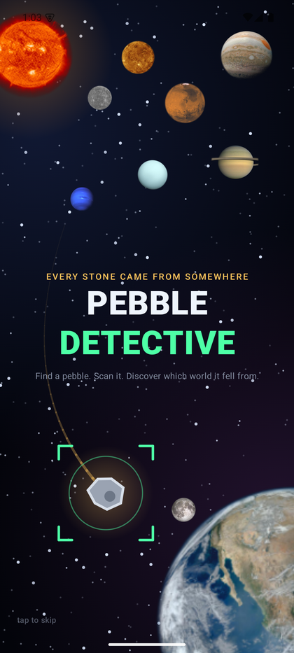

The app opens on the picture above, assembled a piece at a time: the sky, then
the solar system arriving left to right, then Earth and its Moon in the corner,
then a pebble falling in on an amber trail with the scanner brackets closing on
it.

Four seconds, and a tap anywhere ends it early. Then the titles hand over to
**Planets around**, so the app begins where the hunt does — pointing at the
sky — rather than at the camera.

<br clear="right" />

### 1 · Look around you

<p>
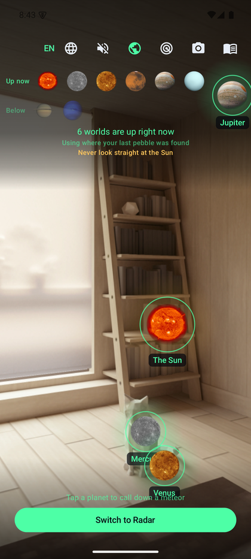
&nbsp;
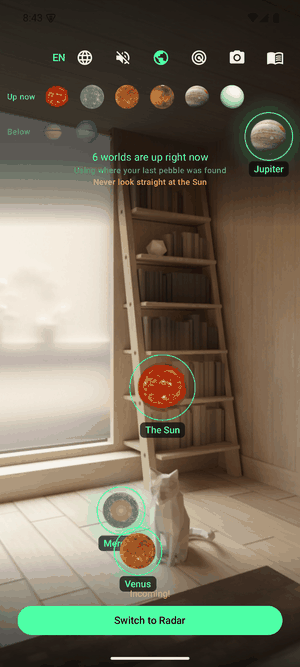
</p>

Hold the phone up and the solar system is drawn over whatever the camera can
see — the Sun, the Moon and the seven planets — each one a real NASA
photograph hanging in the place it actually occupies in the sky. The toolbar splits them into what is **up now** and what
is **below** your feet; tap one to follow just that body, and an arrow points
the way until you have swung the phone round to it.

Tap a planet on the screen and a piece of it comes down — that is the second
picture above, with the phone swinging down to follow it. The fireball is
pinned to a direction in the world rather than to a place on the screen, so
it keeps falling where it fell while you turn after it, and the crater it
leaves in the street stays put.

**And the app remembers.** You just watched a piece of Saturn land, so the
next stone you scan is from Saturn, whatever colour it happens to be. The
Detection screen says so before you take the picture, with a **No, check it**
button beside it — finding out afterwards that the answer had been decided in
advance would feel like the app cheating. It lasts exactly one pebble.

**This is the first of three stages.** Pick a world here, hand over to
**Radar** to go and find where its piece came down, and finish in
**Detection** with the camera on the stone itself:

<p align="center"><b>Planets around</b> → <b>Radar</b> → <b>Detection</b></p>

The button at the bottom of each screen moves you along the chain, and the
three mode buttons in the top bar — globe, radar, camera — jump straight to
any stage, so nobody has to walk the whole thing to photograph a stone they
already have in their hand. Going back retraces the way you came.

**Where the positions come from.** Nowhere. There is no ephemeris file and no
network call: each planet is six numbers and six rates of change, and solving
Kepler’s equation on the phone gives its position at any instant. That is
why it works in a field with no signal, and why it will still be right in
2050. The orbits are good to a few arcminutes; what actually limits the
accuracy is the phone’s compass, which is routinely ten degrees out indoors.

<br clear="right" />

From here a button also opens the [planetarium](#the-planetarium), which is
the same worlds seen from the outside rather than from the ground.

### 2 · Scan the ground for it


Next along the chain. The app **hides a virtual pebble somewhere within
thirty metres** and sends the child out to find it — a reason to walk
somewhere and look down, which is the whole point of the game.

The scope is drawn over the live rear camera: range rings, a rotating sweep,
a pulsing blip and an arrow pointing the way. Your own position is the centre
and moves as you walk, and the whole display turns with the phone — the arrow
keeps pointing at the same patch of ground however you hold it, because the
target is a real coordinate rather than a spot on the screen.

Tapping radar again hides a new pebble from scratch. You can switch on to
Detection at any point, whether or not you reached the target, and the globe
in the top bar goes back up to the sky.

With sound on it plays like a detector: a room tone under the scope, a ping
each time the sweep comes round, and a proximity beep that **quickens as you
close in** — lazy at thirty metres, an urgent chatter at arm's length. The
ping and the drawn sweep share one clock, so the beep lands with the beam
crossing the top rather than drifting against it.

**Radar asks for precise location**, and it is the only part of the app that
does. The logbook is content with coarse accuracy; a thirty-metre hunt is not,
since coarse location is accurate to roughly a city block. The permission is
requested the first time radar is opened, never at startup, and everything
else works without it.

<br clear="right" />

### 3 · Find a pebble


The rear camera opens with a targeting reticle sweeping the view. Tap the stone
and the reticle locks onto it.

The shot is taken when the view **settles** — the reticle fills a ring while the
child holds still, so they can see what the app is waiting for. If their hands
will not stop moving, the threshold relaxes and after a few seconds it takes the
picture anyway. A gate a child cannot satisfy is worse than no gate at all.

With sound on, the scanner idles while you hunt — a low bed with servo ticks
and sample chirps at irregular intervals, so it reads as a machine thinking
rather than a metronome. It hands over to the capture cues the moment you tap.

The moment the shutter fires, the frame freezes. That still is the pebble's
portrait, and it is the exact image the app analyses.

<br clear="right" />

### 4 · Run a Deep Research


A prompt appears over the frozen photograph. Saying yes starts the investigation.

Saying *Not now* throws the stone back and returns to the camera.

<br clear="right" />

### 5 · Watch it think


Five seconds of theatre: a dish sweeps for a satellite signal, the link locks,
and the screen falls into a cascade of glyphs while the analysis lines stream in
and a progress bar fills along the bottom.

Underneath the show, real work happens. The app reads the colour of the pebble
where the child tapped, picks a world, notes the place and time, and writes the
whole thing to the logbook.

It can be skipped at any point.

<br clear="right" />

### 6 · Meet the world


The verdict, with a real NASA photograph of the body, its name, and one fact
sized for a child.

Reddish stones come from Mars. Pale gold ones from Saturn. Deep blue from
Neptune. A plain grey pebble could be from anywhere, so the app picks at
random — and then remembers that choice forever, because a stone that changed
planet every time you looked at it would be no fun at all.

<br clear="right" />

### 7 · Fly it home


It opens on the whole solar system **as it actually stood on the day that
pebble was picked up** — every planet, the Sun and the Moon, each at its real
angle around the Sun, worked out on the phone from the same orbits the sky
mode uses. Only the distances are squashed, because Mercury is a thirtieth of
Neptune's and a true scale is a blank screen with a dot in the corner.

Then the camera picks its two worlds out of that map and closes on them, the
rest of the system fading as the stars come up. The pebble tears itself off
its home world, spinning, and sets out.

Twenty-five seconds of space flight in all. The pebble tumbles along a curving
arc through a warping starfield, its home world shrinking behind it and Earth
swelling ahead, until the last of the crossing lights it up: a sheath of fire
and a wake streaming off the back as Earth’s air starts to bite.

**And it is the right colour.** The pebble in the animation is painted with
the colour measured off the real stone in the photograph, so a rusty one
arrives rusty.

Both worlds are photographs rather than drawings. Earth is specifically a
photograph of the side with Japan on it, because that is where the pebble is
going: every library full-disk Earth is the Americas or Africa, so
this one comes from DSCOVR, which sits a million miles out at the Earth–Sun L1
point and photographs the whole sunlit disc every couple of hours — one frame a
day is centred on the Pacific.

Then it keeps going. The fireball gives way to a map of Japan, the view falls
and closes in through Kanto and over Tokyo Bay, and the pebble finally comes
down between the Sumida and the Arakawa, in Koto.

Also skippable — by the third pebble, nobody wants to sit through the whole
film again.

<br clear="right" />

<p>
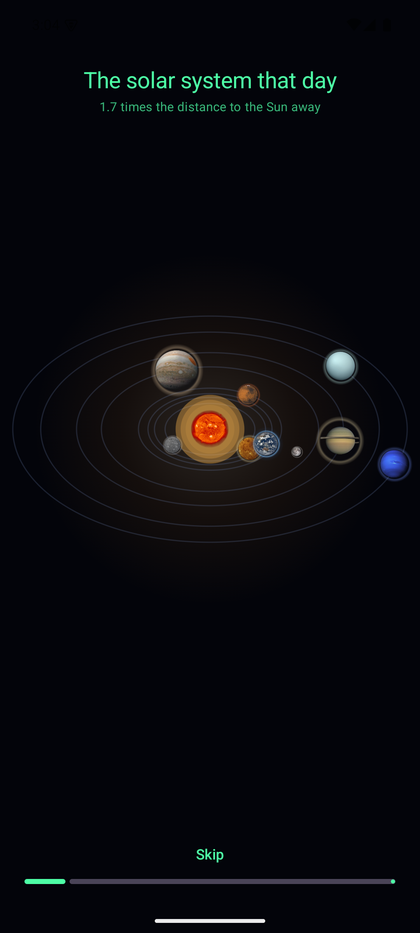
&nbsp;
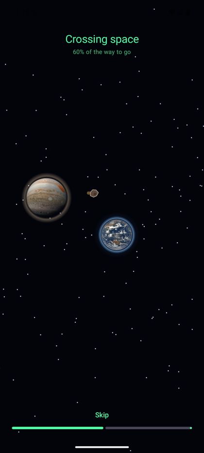
&nbsp;

&nbsp;

</p>

### 8 · Keep the collection

<p>

&nbsp;

&nbsp;

</p>

Every stone is kept: its photograph, the world it came from, when it was found
and — if location was allowed — where. Each can be deleted, and the logbook
shows how much space the collection is using.

Open one and **swipe left or right to walk through the whole collection**
without going back to the list. Arrows and a position counter sit above the
page so the gesture is discoverable and still works for anyone who cannot
swipe, and a **thumbnail strip along the bottom jumps straight to any
pebble** — thirty swipes to reach the far end of a collection is no way to
browse one.

**The coordinates are tappable** and open the spot in a map. This is the one
place the app reaches outside itself: it still holds no network permission and
makes no requests of its own, it simply hands the coordinates to whatever maps
app is installed, and that app does the talking. Worth knowing, because those
coordinates are where a child was standing.

---

## Anywhere, from anywhere

The walkthrough above is one way through. It is not the only one, and after
the first pebble it is not even the usual one.


The four modes are not a sequence. They are four ways of looking at the same
hunt, so **every screen carries the whole toolbar**: language, sound, planets
around you, the planetarium, the radar, the camera and the logbook. The
button for the screen you are on is ringed, so the row says where you are as
well as where you can go.

It sizes itself. Seven controls at a comfortable size come to more than a
small phone is wide, and a toolbar that overflows loses whichever button is
last — the logbook, as it happens. Each control takes an equal share of
whatever width there is. Pressing a mode you have already been through takes
you *back* to it rather than stacking another copy, so the back button still
retraces where you went.

The two timed sequences — the research and the flight home — carry the
language and sound buttons only. Wandering off mid-research abandons a stone
that has already been photographed and logged, and seven buttons across the
top of a twenty-five second showpiece is no way to watch it. Both have their
own way out two inches below.

<br clear="right" />

### The planetarium

<p>
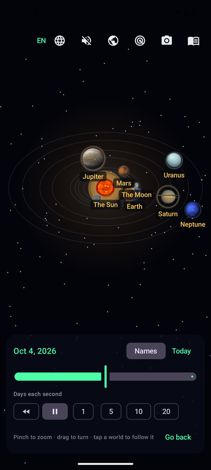
&nbsp;
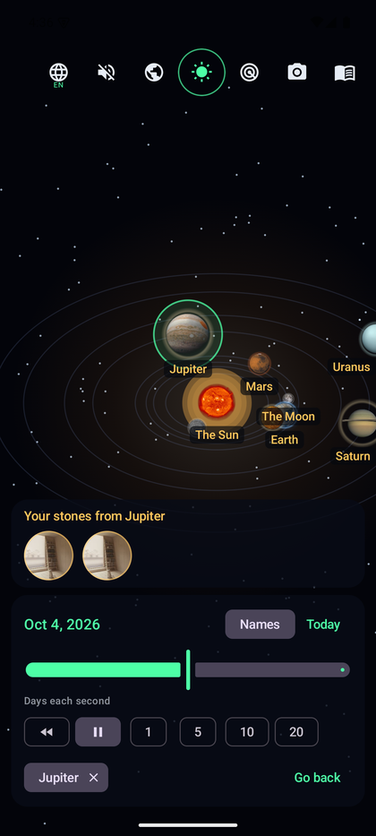
</p>

A **planetarium**: the solar system as a thing to play with rather than to
watch. The same orrery the flight home opens on — the same orbits, the same
photographs, the same arithmetic — but with the clock handed over.

- **Slide the date** ten years each way, or let it run at **1, 5, 10 or 20
  days a second**, forwards or backwards. At twenty, Mercury laps the Sun
  every four seconds, Earth takes eighteen, and Saturn barely leans.
- **Pinch to zoom, drag to turn it.** Sideways swings the camera round the
  Sun; up and down flattens the plane towards edge-on.
- **Tap a world to follow it.** It takes the middle of the screen and stays
  there while the rest of the system sweeps past — which is the clearest
  way to see that Mars really does loop backwards against the stars.
- **Names on or off**, and the ones that would sit on top of each other are
  dropped rather than overlapped; zoom in and they come back.

**Every planet picture in the app is a door into it.** The badge on the
detection banner, the portrait on the result screen, the world on a logbook
row and the one on a pebble's own page all open the planetarium *on that
world*, zoomed so its orbit fills the screen with everything else still in
its real place around it.

**And the door swings both ways.** Follow a world that has sent you
something and your own stones from it appear along the bottom — not a count
and not a link to a filtered list, but the photographs you took, round like
little moons. Tap one and you are on its page in the logbook. A child
recognises a stone they picked up long before they recognise a number, and
the strip turns up at exactly the moment the question arises, which is the
moment they tapped that planet.

**Only distances are lies here, and only where they have to be.** Mercury is
a thirtieth of Neptune's distance from the Sun, so a true scale is a blank
screen with a dot in the corner: the radii go through a power law and the
angles do not. The Moon gets the same treatment for the same reason — its
real offset from the Earth is a fraction of a pixel at this scale — but only
its *distance* is exaggerated. Its bearing is the true one, so it circles in
its twenty-seven days and passes in front of the Earth for half of each
month and behind it for the other half.

---

## Three languages, at any moment

**English, Russian and Japanese**, switched with the globe button on *every*
screen — including halfway through the research or mid-flight. The button
carries the current code under it, so which of the three you are in is
readable at a glance.

The language is applied inside the composition rather than by restarting the
activity, so switching it never interrupts the camera and never restarts an
animation in progress. The sequence you were watching carries on from the frame
it was on.

Russian needs more than a lookup table. A pebble does not come **с Марс** but
**с Марса**, and the ending differs by word — Венеры, Юпитера, Солнца. There is
no rule a format string can apply, so every body carries a second name in the
genitive, and the languages that do not inflect simply repeat the first one.

---

## It never touches the network

The "Deep Research" is theatre. There is no server, no account, and **no
networking of any kind**.

```console
$ ./gradlew :app:assembleDebug
$ grep -c INTERNET app/build/intermediates/merged_manifest/debug/*/AndroidManifest.xml
0
```

The merged manifest holds exactly two permissions:

| Permission | Why | Required? |
|---|---|---|
| `CAMERA` | to see the pebble | yes — and if refused, the Android photo picker is offered instead, which needs no permission at all |
| `ACCESS_COARSE_LOCATION` | to remember where a stone was found | **no** — refuse it and everything still works, just without a place |
| `ACCESS_FINE_LOCATION` | radar mode only, which hides a pebble within 30 m | **no** — asked when radar is first opened; the rest of the app never needs it |

This is enforced, not merely intended. `camera-view` pulls in a video dependency
that drags `ACCESS_NETWORK_STATE` along with it, so that module is excluded and
the manifest carries explicit `tools:node="remove"` entries for both network
permissions. A new library cannot quietly reintroduce them.

Photographs are written to the app's private storage. Nothing a child
photographs leaves the phone.

---

## Which world does a stone come from?

The app samples a disc around the point the child tapped, throws away shadow and
the blown-out white of a wet stone, and takes the dominant hue.

| The stone looks… | | It came from |
|---|:-:|---|
| red, rusty |  | **Mars** |
| orange, brown | 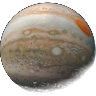 | **Jupiter** |
| bright yellow |  | **the Sun** |
| creamy, dull yellow |  | **Venus** |
| pale gold, sandy | 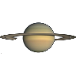 | **Saturn** |
| green, teal, pale blue | 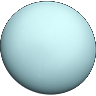 | **Uranus** |
| deep blue | 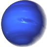 | **Neptune** |
| almost black | 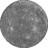 | **Mercury** |
| **pale grey** | 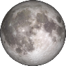 | **the Moon** |
| **grey, or no clear colour** | | **anywhere — picked at random** |

Pale grey is the Moon on purpose. It is the one world in the game a child has
looked straight at, it is exactly that colour, and sending that stone off to a
random planet throws away the one guess they could have made themselves.

Earth is never an answer. A pebble that flew from Earth to Earth is not a story.

---

## Building it yourself

Needs the Android SDK and JDK 17. Everything else the Gradle wrapper fetches.

```bash
git clone https://github.com/dmitryaleks/PebbleDetective.git
cd PebbleDetective
echo "sdk.dir=/path/to/Android/Sdk" > local.properties

./gradlew :app:assembleDebug          # build
./gradlew :app:installDebug           # install over USB
./gradlew :app:testDebugUnitTest      # 146 unit tests
```

For a signed release build, create `keystore.properties` beside `local.properties`:

```properties
storeFile=pebble-release.jks
storePassword=…
keyAlias=pebble
keyPassword=…
```

…then `./gradlew :app:assembleRelease`. Without that file the release build still
configures; it just produces an unsigned APK. Neither the keystore nor its
passwords are in this repository.

### Regenerating the artwork in this README

```console
python tools/make_banner.py                  # the hero image
python tools/make_world_thumbs.py            # the discs in the colour table
python tools/fetch_assets.py                 # the bundled photos and sounds
python tools/capture_docs.py  <serial>       # every screen but the sky
python tools/capture_sky.py   <serial>       # the sky, and a meteor
```

The two capture scripts drive a connected device. They find buttons by their
accessibility labels rather than by pixel coordinates, because the toolbar has
grown twice and every time the hard-coded taps quietly started pressing
whatever had moved into their place. The sky needs the emulator’s virtual
compass pointed at a planet, which is why it is a script of its own.

---

## How it is built

| | |
|---|---|
| **Language** | Kotlin 2.4, via AGP's built-in Kotlin |
| **UI** | Jetpack Compose, single activity, Navigation Compose |
| **Camera** | CameraX 1.6 — preview and stills, rear lens |
| **Storage** | JSON Lines index plus JPEGs in internal storage |
| **Location** | platform `LocationManager` — deliberately not Play Services |
| **DI** | a hand-written container; no Hilt, no annotation processing |
| **Build** | AGP 9.4, Gradle 9.8, `minSdk 26`, `targetSdk 36` |

A few decisions worth knowing about:

- **Both timed sequences run on a wall clock**, not on Compose animations. That
  is what lets a language switch resume mid-animation, makes the timing unit
  testable, and stops the whole thing collapsing to nothing on a device with
  animations disabled — where the app skips them outright instead.
- **The logbook is JSON Lines, appended.** A process killed mid-write costs at
  most a torn last line, which is dropped on read. Rewriting a whole JSON array
  every time would risk the entire collection.
- **The capture is rotated in memory, never by EXIF.** Writing orientation into
  EXIF and decoding it later makes the picture on screen and the pixels being
  analysed disagree by ninety degrees on most phones.
- **The sky is computed, not downloaded.** JPL’s approximate Keplerian
  elements for 1800 to 2050, Kepler’s equation solved by Newton’s method, and
  two coordinate transforms. The whole of it is one file of arithmetic with
  no assets behind it, and the unit tests check it against things that
  are true of the solar system - the equinoxes, the maximum elongations of
  Mercury and Venus, the opposition cycle of each outer planet - rather than
  against a copied table.
- **The Moon is the exception, and gets its own theory.** It is pulled about
  by the Sun as hard as an ellipse can stand, so six elements leave it
  several degrees out, which for something half a degree wide and hanging in
  plain sight will not do. It uses the leading periodic terms instead, and it
  is close enough that the app also has to allow for where on the Earth you
  are standing. The test for it is solar eclipses: on four published dates it
  has to pass in front of the Sun, which pins the theory absolutely rather
  than merely consistently.
- **The compass needs correcting before it can point at a planet.** It reports
  bearings from magnetic north and the sky is worked out from true north, a
  difference of up to twenty degrees depending where you are standing.
  Android’s built-in world magnetic model supplies the correction offline.
- **The journey is drawn, not rendered.** A hand-rolled perspective projection
  on a Compose canvas, with the starfield in flat arrays so the draw phase
  allocates nothing per frame. The two worlds in it are the real
  photographs, projected into that scene and lit at the limb; everything
  around them — the stars, the pebble, its trail, the fire — is drawn.
- **The opening shot is the same arithmetic as the sky mode.** The orrery
  is not a picture: every body is placed from its own orbit at the moment
  the pebble was found, so replaying an old entry shows the sky of the
  evening it was found rather than tonight. The radii are compressed by a
  power law, which is what every orrery ever built does and for the same
  reason.
- **And the planetarium is the same orrery again.** One function places a
  body, shared by the flight and by the screen you can scrub - two copies
  would be two orreries that slowly drifted apart. What the planetarium
  adds is the clock, and it keeps that clock out of composition: the
  moment, the zoom and the rotation are read only inside the draw lambda,
  so running time at twenty days a second invalidates the drawing and
  nothing else.
- **A compression has to be applied to the distance, not to the
  coordinates.** Squashing x and y apart is not a compression but a warp
  of the plane: circular orbits came out as rounded squares, and because
  a power law has an infinite slope at zero, a planet leapt sideways
  every time a coordinate crossed an axis. Neither was visible in the
  four seconds the flight home shows the orrery for. Both were the first
  thing anyone saw once the planetarium could run a clock at twenty days
  a second - which is the argument for building the toy version of a
  thing you have already shipped.
- **The landing is a map, drawn the same way.** Coastlines as lists of degrees,
  projected with the longitude squeezed by the cosine of the latitude, at three
  levels of detail that hand over as the scale drops - the islands of Japan,
  then the coast of Kanto with Tokyo Bay cut into it, then the streets. The pan
  is tied to the zoom scale rather than to elapsed time, which is what keeps
  the landing site in frame the whole way down.

---

## Credits

Planet photographs come from the [NASA Image and Video
Library](https://images.nasa.gov/) and are in the public domain. NASA does not
endorse this app.

Sound effects are [*60 CC0 Sci-Fi
SFX*](https://opengameart.org/content/60-cc0-sci-fi-sfx) by **rubberduck**,
released under CC0 1.0.

Every bundled file, with its source and licence, is listed in
**[ASSETS.md](ASSETS.md)**.

---

<div align="center">
<sub>Built for a kid who kept asking where stones come from.</sub>
</div>
